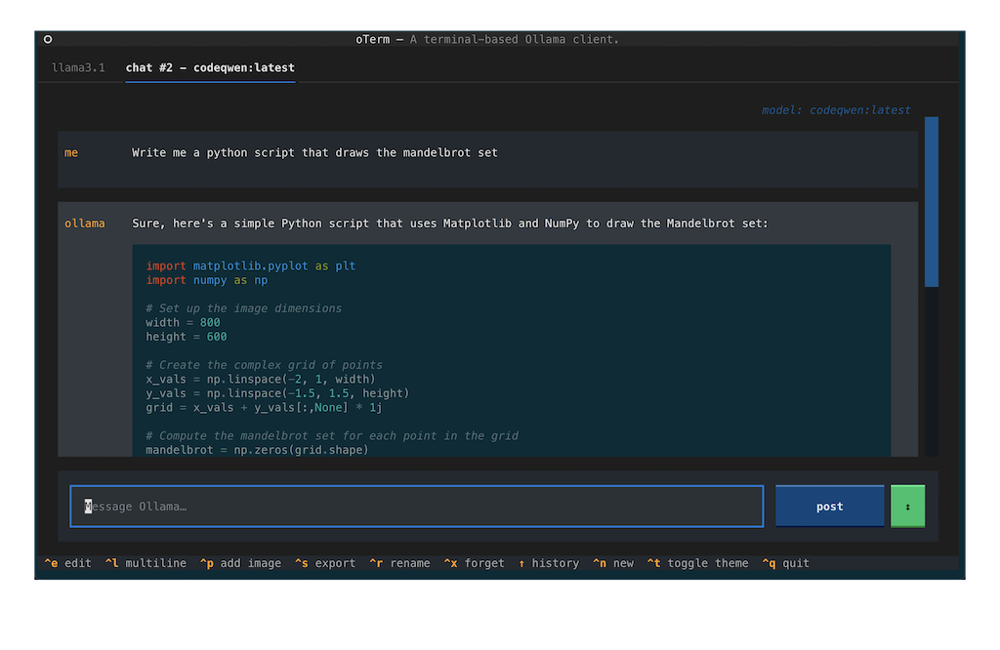
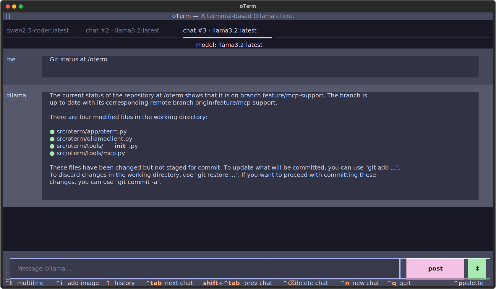
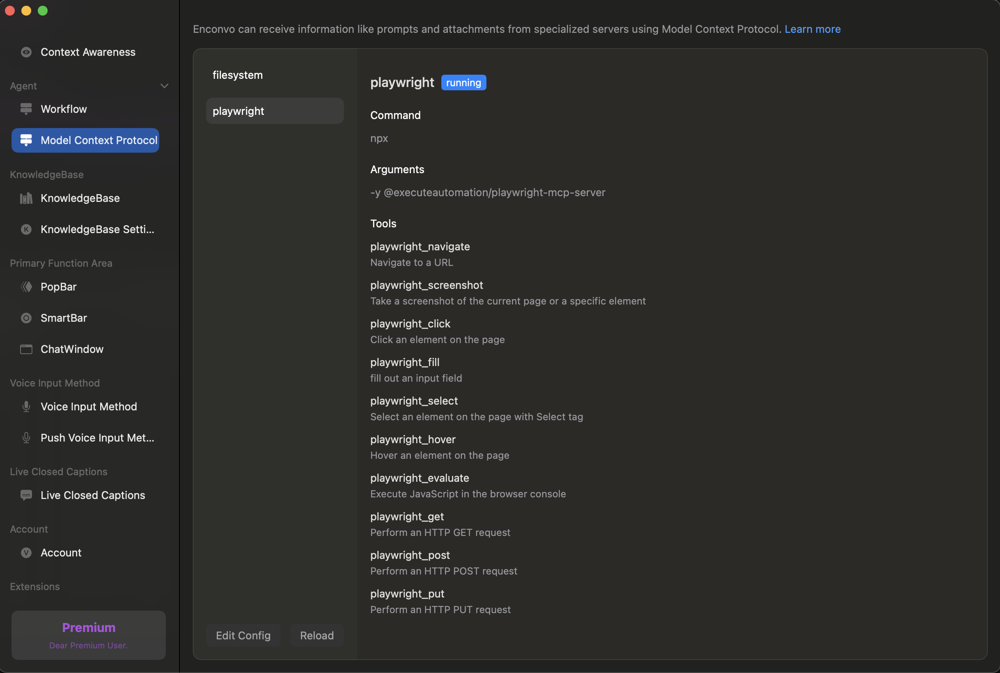

# 精选的优秀模型上下文协议 (MCP) 客户端列表 

[README.md](README.md)

[精选的优秀模型上下文协议 (MCP) 服务端列表](mcp-servers.md)

## Clients

- [5ire](#5ire)
- [ChatMCP](#chatmcp)
- [Claude Desktop](#claude-desktop)
- [ClaudeMind](#claudemind)
- [Cline](#cline)
- [console-chat-gpt](#console-chat-gpt)
- [Copilot-MCP](#copilot-mcp)
- [Cursor](#cursor)
- [Continue](#continue)
- [Dolphin-MCP](#dolphin-mcp)
- [Goose](#goose)
- [http4k MCP Desktop](#http4k-mcp-desktop)
- [HyperChat](#hyperchat)
- [kibitz](#kibitz)
- [LibreChat](#librechat)
- [MCP Chatbot](#mcp-chatbot)
- [MCP CLI client](#mcp-cli-client)
- [MCP Simple Slackbot](#mcp-simple-slackbot)
- [NextChat](#nextchat)
- [oterm](#oterm)
- [Superinterface](#superinterface)
- [SeekChat](#seekchat)
- [Tester MCP Client](#tester-mcp-client)
- [Witsy](#witsy)
- [Enconvo](#enconvo)
- [y-cli](#y-cli)
- [Zed](#zed)

### 5ire

<table>
<tr><th align="left">GitHub</th><td>https://github.com/nanbingxyz/5ire</td></tr>
<tr><th align="left">Website</th><td>https://5ire.app/</td></tr>
<tr><th align="left">License</th><td>GNU v3</td></tr>
<tr><th align="left">Type</th><td>Desktop app</td></tr>
<tr><th align="left">Platforms</th><td>Windows, MacOS, Linux</td></tr>
<tr><th align="left">Pricing</th><td>Free</td></tr>
<tr><th align="left">Programming Languages</th><td>TypeScript</td></tr>
</table>

5ire is a cross-platform desktop AI assistant, MCP client. It compatible with major service providers, supports local knowledge base and tools via model context protocol servers.

5ire 是一款跨平台的桌面人工智能助手和 MCP 客户端。它兼容主要的服务提供商，并通过模型上下文协议服务器支持本地知识库和工具。

Screenshots

https://github.com/user-attachments/assets/a27494c5-437d-481c-a25f-74cfa5a2bc45

### ChatMCP

<table>
<tr><th align="left">GitHub</th><td>https://github.com/daodao97/chatmcp</td></tr>
<tr><th align="left">Website</th><td>-</td></tr>
<tr><th align="left">License</th><td>Apache 2.0</td></tr>
<tr><th align="left">Type</th><td>Desktop app</td></tr>
<tr><th align="left">Platforms</th><td>Windows, MacOS, Linux</td></tr>
<tr><th align="left">Pricing</th><td>Free</td></tr>
<tr><th align="left">Programming Languages</th><td>Dart</td></tr>
</table>

ChatMCP is an AI chat client implementing the Model Context Protocol (MCP).

ChatMCP 是一款实现了模型上下文协议（MCP）的人工智能聊天客户端。

Screenshots

### Claude Desktop

<table>
<tr><th align="left">GitHub</th><td>-</td></tr>
<tr><th align="left">Website</th><td>https://claude.ai/download</td></tr>
<tr><th align="left">License</th><td>Proprietary</td></tr>
<tr><th align="left">Type</th><td>Desktop app</td></tr>
<tr><th align="left">Platforms</th><td>Windows, MacOS</td></tr>
<tr><th align="left">Pricing</th><td>Free</td></tr>
<tr><th align="left">Programming Languages</th><td>-</td></tr>
</table>

The Claude desktop app brings Claude's capabilities directly to your computer, allowing for seamless integration with your workflow.

Claude 桌面应用程序将 Claude 的功能直接带到您的计算机上，实现了与您工作流程的无缝集成。

Screenshots

### ClaudeMind

<table>
<tr><th align="left">GitHub</th><td>-</td></tr>
<tr><th align="left">Website</th><td>https://claudemind.com/</td></tr>
<tr><th align="left">License</th><td>Proprietary</td></tr>
<tr><th align="left">Type</th><td>Desktop app, JetBrains extension</td></tr>
<tr><th align="left">Platforms</th><td>Windows, MacOS</td></tr>
<tr><th align="left">Pricing</th><td>Per seat (from $29)</td></tr>
<tr><th align="left">Programming Languages</th><td>-</td></tr>
</table>

Experience Claude AI without limits. Use our desktop app for everyday AI assistance, or boost your coding productivity with our JetBrains plugin.

无限制地体验 Claude 人工智能。使用 ClaudeMind 的桌面应用程序获取日常人工智能辅助，或者通过 JetBrains 插件提升您的编码效率。

Screenshots

### Cline

<table>
<tr><th align="left">GitHub</th><td>https://github.com/cline/cline</td></tr>
<tr><th align="left">Website</th><td>https://marketplace.visualstudio.com/items?itemName=saoudrizwan.claude-dev</td></tr>
<tr><th align="left">License</th><td>Apache 2.0</td></tr>
<tr><th align="left">Type</th><td>VSCode extension</td></tr>
<tr><th align="left">Platforms</th><td>Windows, MacOS</td></tr>
<tr><th align="left">Pricing</th><td>Free</td></tr>
<tr><th align="left">Programming Languages</th><td>TypeScript</td></tr>
</table>

Cline can handle complex software development tasks step-by-step. With tools that let him create & edit files, explore large projects, use the browser, and execute terminal commands (after you grant permission), he can assist you in ways that go beyond code completion or tech support. Cline can even use the Model Context Protocol (MCP) to create new tools and extend his own capabilities. While autonomous AI scripts traditionally run in sandboxed environments, this extension provides a human-in-the-loop GUI to approve every file change and terminal command, providing a safe and accessible way to explore the potential of agentic AI.

Cline 能够逐步处理复杂的软件开发任务。凭借创建和编辑文件、探索大型项目、使用浏览器以及执行终端命令（需获得您的授权）的工具，他能够以超越代码补全或技术支持的方式为您提供帮助。Cline 甚至可以使用模型上下文协议（MCP）来创建新的工具并扩展自己的能力。尽管自主人工智能脚本通常在沙盒环境中运行，但此扩展提供了一个有人在环的图形用户界面来批准每一个文件更改和终端命令，提供了一种安全且易于探索自主智能体人工智能潜力的方式。

Screenshots

### console-chat-gpt

<table>
<tr><th align="left">GitHub</th><td>https://github.com/amidabuddha/console-chat-gpt</td></tr>
<tr><th align="left">Website</th><td>-</td></tr>
<tr><th align="left">License</th><td>MIT</td></tr>
<tr><th align="left">Type</th><td>CLI</td></tr>
<tr><th align="left">Platforms</th><td>Windows, MacOS, Linux</td></tr>
<tr><th align="left">Pricing</th><td>Free</td></tr>
<tr><th align="left">Programming Languages</th><td>Python</td></tr>
</table>

Enjoy seamless interactions with ChatGPT, MistralAI, Claude by Anthropic, Grok by xAI, Gemini by Google and DeepSeek directly from your command line. Elevate your chat experience with efficiency and ease.

从您的命令行直接与 ChatGPT、MistralAI、Anthropic 的 Claude、xAI 的 Grok、Google 的 Gemini 以及 DeepSeek 享受无缝交互。通过高效和便捷的方式提升您的聊天体验。

Screenshots

### Copilot-MCP

<table>
<tr><th align="left">GitHub</th><td>https://github.com/VikashLoomba/copilot-mcp</td></tr>
<tr><th align="left">Website</th><td>-</td></tr>
<tr><th align="left">License</th><td>GPL-v3</td></tr>
<tr><th align="left">Type</th><td>VSCode Extension</td></tr>
<tr><th align="left">Platforms</th><td>Windows, MacOS, Linux</td></tr>
<tr><th align="left">Pricing</th><td>Free</td></tr>
<tr><th align="left">Programming Languages</th><td>Any</td></tr>
</table>

VSCode extension that acts as a Model Context Protocol (MCP) client, enabling integration between MCP servers and GitHub Copilot Chat.

作为模型上下文协议（MCP）客户端的 VSCode 扩展，支持 MCP 服务器与 GitHub Copilot Chat 的集成。

Screenshots

### Cursor

<table>
<tr><th align="left">GitHub</th><td>https://github.com/getcursor/cursor</td></tr>
<tr><th align="left">Website</th><td>https://cursor.com</td></tr>
<tr><th align="left">License</th><td>Proprietary</td></tr>
<tr><th align="left">Type</th><td>Desktop app</td></tr>
<tr><th align="left">Platforms</th><td>Windows, MacOS, Linux</td></tr>
<tr><th align="left">Pricing</th><td>Freemium</td></tr>
<tr><th align="left">Programming Languages</th><td>TypeScript</td></tr>
</table>

Cursor is an AI-first code editor fork of VS Code that helps you code faster with built-in chat, edit, and debugging AI features. It supports MCP for enhanced AI capabilities and tool integration.

Cursor 是基于 VS Code 的 AI 优先代码编辑器，通过内置的聊天、编辑和调试 AI 功能帮助您更快地编写代码。它支持 MCP 以增强 AI 能力和工具集成。

Screenshots

### Continue

<table>
<tr><th align="left">GitHub</th><td>https://github.com/continuedev/continue</td></tr>
<tr><th align="left">Website</th><td>https://continue.dev/</td></tr>
<tr><th align="left">License</th><td>Apache 2.0</td></tr>
<tr><th align="left">Type</th><td>VSCode extension, JetBrains extension</td></tr>
<tr><th align="left">Platforms</th><td>Windows, MacOS</td></tr>
<tr><th align="left">Pricing</th><td>Free</td></tr>
<tr><th align="left">Programming Languages</th><td>TypeScript</td></tr>
</table>

Continue is the leading open-source AI code assistant. You can connect any models and any context to build custom autocomplete and chat experiences inside VS Code and JetBrains.

Continue 是领先的开源人工智能代码助手。您可以在 VS Code 和 JetBrains 中连接任何模型和任何上下文，以构建自定义的自动补全和聊天体验。

Screenshots

### Dolphin-MCP

<table>
<tr><th align="left">GitHub</th><td>https://github.com/cognitivecomputations/dolphin-mcp</td></tr>
<tr><th align="left">Website</th><td>-</td></tr>
<tr><th align="left">License</th><td>MIT</td></tr>
<tr><th align="left">Type</th><td>CLI, Python library</td></tr>
<tr><th align="left">Platforms</th><td>Linux, Windows, MacOS</td></tr>
<tr><th align="left">Pricing</th><td>Free</td></tr>
<tr><th align="left">Programming Languages</th><td>Python</td></tr>
</table>

**Dolphin-MCP** is an open-source multi-server bridging client for MCP. It allows you to connect any MCP-compatible server any LLM (local or remote), enabling flexible tool usage and resource access in real-time.

**Dolphin-MCP** 是一款开源的多服务器桥接客户端，用于 MCP。它允许您将任何 MCP 兼容的服务器连接到任何 LLM（本地或远程），实现实时的灵活工具使用和资源访问。

`pip install dolphin-mcp`

Screenshots

### Goose

<table>
<tr><th align="left">GitHub</th><td>https://github.com/block/goose</td></tr>
<tr><th align="left">Website</th><td>-</td></tr>
<tr><th align="left">License</th><td>Apache 2.0</td></tr>
<tr><th align="left">Type</th><td>AI Agent</td></tr>
<tr><th align="left">Platforms</th><td>MacOS, Linux</td></tr>
<tr><th align="left">Pricing</th><td>Free</td></tr>
<tr><th align="left">Programming Languages</th><td>Rust</td></tr>
</table>

Goose is a general-purpose AI agent that can dynamically plug into new extensions and learn how to use them. It solves higher-level problems using tools from multiple extensions and can interact with multiple extensions at once.

Goose 是一个通用的人工智能代理，能够动态地插入新的扩展并学习如何使用它们。它使用来自多个扩展的工具解决更高级别的问题，并且可以同时与多个扩展进行交互。

Screenshots

### http4k MCP Desktop

<table>
<tr><th align="left">GitHub</th><td>https://github.com/http4k/mcp-desktop</td></tr>
<tr><th align="left">Website</th><td>https://mcp.http4k.org</td></tr>
<tr><th align="left">License</th><td>Proprietary</td></tr>
<tr><th align="left">Type</th><td>StdIO -> Remote MCP proxy</td></tr>
<tr><th align="left">Platforms</th><td>MacOS, Windows, Linux</td></tr>
<tr><th align="left">Pricing</th><td>Per seat (see site). Free for non-commercial/non-profit/research</td></tr>
<tr><th align="left">Programming Languages</th><td>Native binary, written in Kotlin</td></tr>
</table>

The http4k MCP Desktop Client serves as a proxy that enables communication between desktop applications and MCP servers. While it works with any MCP-compliant server, it's specially optimized for servers built using the [http4k MCP SDK](https://mcp.http4k.org).

**Features**

- Multiple remote transport options: SSE (Server-Sent Events), JSON-RPC (stateless) and WebSocket.
- Various standard authentication methods: API Key, Bearer Token, Basic Auth, and OAuth
- Customizable reconnection logic

http4k MCP 桌面客户端充当代理，实现桌面应用程序与 MCP 服务器之间的通信。它与任何符合 MCP 标准的服务器兼容，但特别针对使用[http4k MCP SDK](https://mcp.http4k.org)构建的服务器进行了优化。

**功能**

- 提供多种远程传输选项：SSE（服务器发送事件）、JSON-RPC（无状态）和 WebSocket。
- 支持多种标准认证方法：API 密钥、Bearer 令牌、基本认证和 OAuth。
- 可自定义的重连逻辑。

### HyperChat

<table>
<tr><th align="left">GitHub</th><td>https://github.com/BigSweetPotatoStudio/HyperChat</td></tr>
<tr><th align="left">Website</th><td>-</td></tr>
<tr><th align="left">License</th><td>Apache 2.0<a href="https://github.com/BigSweetPotatoStudio/HyperChat/blob/main/LICENSE">*</a></td></tr>
<tr><th align="left">Type</th><td>Desktop app</td></tr>
<tr><th align="left">Platforms</th><td>Windows, MacOS</td></tr>
<tr><th align="left">Pricing</th><td>Free</td></tr>
<tr><th align="left">Programming Languages</th><td>JavaScript</td></tr>
</table>

HyperChat is an open Chat client that can use various LLM APIs to provide the best Chat experience and implement productivity tools through the MCP protocol.

HyperChat 是一款开源聊天客户端，能够使用多种大型语言模型（LLM）API 提供最佳的聊天体验，并通过模型上下文协议（MCP）实现生产力工具。

Screenshots

### kibitz

<table>
<tr><th align="left">GitHub</th><td>https://github.com/nick1udwig/kibitz</td></tr>
<tr><th align="left">Website</th><td>https://kibi.tz</td></tr>
<tr><th align="left">License</th><td>MIT</td></tr>
<tr><th align="left">Type</th><td>Mobile app, Desktop app</td></tr>
<tr><th align="left">Platforms</th><td>Mobile, Windows, MacOS, Linux</td></tr>
<tr><th align="left">Pricing</th><td>Free</td></tr>
<tr><th align="left">Programming Languages</th><td>TypeScript</td></tr>
</table>

kibitiz is the free and open-source Replit. Minimally, it is a lightweight chat interface to the popular LLM APIs (Anthropic and OpenAI API formats supported). Experience automated tool loops: try asking your agent to use [wcgw](https://github.com/rusiaaman/wcgw) to make a change to a local repository, then fix linter and compiler errors, make a commit, and push to remote, all without user intervention! Even better, code on-the-go by setting up MCP servers on your laptop, then connecting from your mobile through [Kinode](https://github.com/kinode-dao/kinode).

kibitiz 是一个免费且开源的 Replit。它至少是一个轻量级的聊天界面，支持流行的大型语言模型 API（支持 Anthropic 和 OpenAI API 格式）。体验自动化的工具循环：尝试让您的代理使用[wcgw](https://github.com/rusiaaman/wcgw)对本地仓库进行更改，然后修复 linter 和编译器错误，提交更改并推送到远程仓库，所有这些操作都不需要用户干预！更进一步，您可以通过在笔记本电脑上设置 MCP 服务器，然后通过[Kinode](https://github.com/kinode-dao/kinode)从移动设备连接，随时随地编写代码。

Screenshots

  
https://github.com/user-attachments/assets/3f8df448-1c81-4ff2-8598-c48283a4dc00

### LibreChat

<table>
<tr><th align="left">GitHub</th><td>https://github.com/danny-avila/LibreChat</td></tr>
<tr><th align="left">Website</th><td>https://www.librechat.ai/</td></tr>
<tr><th align="left">License</th><td>MIT license</td></tr>
<tr><th align="left">Type</th><td>Web app</td></tr>
<tr><th align="left">Platforms</th><td>-</td></tr>
<tr><th align="left">Pricing</th><td>Free</td></tr>
<tr><th align="left">Programming Languages</th><td>TypeScript</td></tr>
</table>

Enhanced ChatGPT Clone: Features Agents, Anthropic, AWS, OpenAI, Assistants API, Azure, Groq, o1, GPT-4o, Mistral, OpenRouter, Vertex AI, Gemini, Artifacts, AI model switching, message search, Code Interpreter, langchain, DALL-E-3, OpenAPI Actions, Functions, Secure Multi-User Auth, Presets, open-source for self-hosting.

增强版 ChatGPT 克隆：支持代理、Anthropic、AWS、OpenAI、助手 API、Azure、Groq、o1、GPT-4o、Mistral、OpenRouter、Vertex AI、Gemini、工件、人工智能模型切换、消息搜索、代码解释器、LangChain、DALL·E 3、OpenAPI 操作、函数、安全多用户认证、预设，开源用于自主托管。

Screenshots

### MCP Chatbot

<table>
<tr><th align="left">GitHub</th><td>https://github.com/3choff/mcp-chatbot</td></tr>
<tr><th align="left">Website</th><td>-</td></tr>
<tr><th align="left">License</th><td>MIT</td></tr>
<tr><th align="left">Type</th><td>CLI</td></tr>
<tr><th align="left">Platforms</th><td>Windows, MacOS, Linux</td></tr>
<tr><th align="left">Pricing</th><td>Free</td></tr>
<tr><th align="left">Programming Languages</th><td>Python</td></tr>
</table>

This chatbot example demonstrates how to integrate the Model Context Protocol (MCP) into a simple CLI chatbot. The implementation showcases MCP's flexibility by supporting multiple tools through MCP servers and is compatible with any LLM provider that follows OpenAI API standards.

这个聊天机器人示例展示了如何将模型上下文协议（MCP）集成到一个简单的命令行界面（CLI）聊天机器人中。该实现通过支持多个工具的 MCP 服务器，展示了 MCP 的灵活性，并且兼容任何遵循 OpenAI API 标准的大型语言模型（LLM）提供商。

### MCP CLI client

<table>
<tr><th align="left">GitHub</th><td>https://github.com/adhikasp/mcp-client-cli</td></tr>
<tr><th align="left">Website</th><td>-</td></tr>
<tr><th align="left">License</th><td>MIT</td></tr>
<tr><th align="left">Type</th><td>CLI</td></tr>
<tr><th align="left">Platforms</th><td>Windows, MacOS, Linux</td></tr>
<tr><th align="left">Pricing</th><td>Free</td></tr>
<tr><th align="left">Programming Languages</th><td>Python</td></tr>
</table>

A simple CLI to run LLM prompt and implement MCP client.

一个简单的命令行界面（CLI），用于运行大型语言模型（LLM）提示并实现 MCP 客户端。

Screenshots

### MCP Simple Slackbot

<table>
<tr><th align="left">GitHub</th><td>https://github.com/sooperset/mcp-client-slackbot</td></tr>
<tr><th align="left">Website</th><td>-</td></tr>
<tr><th align="left">License</th><td>MIT</td></tr>
<tr><th align="left">Type</th><td>Slack Bot</td></tr>
<tr><th align="left">Platforms</th><td>Slack</td></tr>
<tr><th align="left">Pricing</th><td>Free</td></tr>
<tr><th align="left">Programming Languages</th><td>Python</td></tr>
</table>

A simple Slack bot that uses LLMs and the Model Context Protocol (MCP) tools.

一个简单的 Slack 机器人，使用大型语言模型（LLMs）和模型上下文协议（MCP）工具。

Screenshots

### NextChat

<table>
<tr><th align="left">GitHub</th><td>https://github.com/ChatGPTNextWeb/NextChat</td></tr>
<tr><th align="left">Website</th><td>https://nextchat.club/</td></tr>
<tr><th align="left">License</th><td>MIT</td></tr>
<tr><th align="left">Type</th><td>Web app</td></tr>
<tr><th align="left">Platforms</th><td>Windows, MacOS, Linux</td></tr>
<tr><th align="left">Pricing</th><td>Free</td></tr>
<tr><th align="left">Programming Languages</th><td>TypeScript</td></tr>
</table>

NextChat: Light and Fast AI Assistant, with Claude, DeepSeek, GPT4, Gemini Pro & MCP support.

NextChat：轻量快速的 AI 助手，支持 Claude、DeepSeek、GPT-4、Gemini Pro 和 MCP。

Screenshots

### oterm

<table>
<tr><th align="left">GitHub</th><td>https://github.com/ggozad/oterm</td></tr>
<tr><th align="left">Website</th><td>-</td></tr>
<tr><th align="left">License</th><td>MIT</td></tr>
<tr><th align="left">Type</th><td>CLI</td></tr>
<tr><th align="left">Platforms</th><td>Windows, MacOS, Linux</td></tr>
<tr><th align="left">Pricing</th><td>Free</td></tr>
<tr><th align="left">Programming Languages</th><td>Python</td></tr>
</table>

A terminal client for Ollama, with support for MCP servers.

一个用于 Ollama 的终端客户端，支持 MCP 服务器。

Screenshots

### Superinterface

<table>
<tr><th align="left">GitHub</th><td>https://github.com/supercorp-ai/superinterface</td></tr>
<tr><th align="left">Website</th><td>https://superinterface.ai</td></tr>
<tr><th align="left">License</th><td>Proprietary</td></tr>
<tr><th align="left">Type</th><td>Web app</td></tr>
<tr><th align="left">Platforms</th><td>Web</td></tr>
<tr><th align="left">Pricing</th><td>Freemium</td></tr>
<tr><th align="left">Programming Languages</th><td>TypeScript</td></tr>
</table>

Superinterface is AI infrastructure and a developer platform to build in-app AI assistants with support for MCP, interactive components, client-side function calling and more.

Key features:

- Use tools from MCP servers in assistants embedded via React components or script tags
- SSE transport support
- Use any AI model from any AI provider (OpenAI, Anthropic, Ollama, others)

Superinterface 是一个 AI 基础设施和开发者平台，可用于构建应用内 AI 助手，支持 MCP、交互式组件、客户端函数调用等功能。

### 主要特点：

- 在嵌入的助手中使用 MCP 服务器提供的工具（通过 React 组件或 script 标签）
- 支持 SSE 传输
- 可使用来自任何 AI 提供商的 AI 模型（如 OpenAI、Anthropic、Ollama 等）

Screenshots

### SeekChat

<table>
<tr><th align="left">GitHub</th><td>https://github.com/seekrays/seekchat</td></tr>
<tr><th align="left">Website</th><td>https://seekrays.com/chat/</td></tr>
<tr><th align="left">License</th><td>Apache 2.0</td></tr>
<tr><th align="left">Type</th><td>Desktop app</td></tr>
<tr><th align="left">Platforms</th><td>Windows, MacOS</td></tr>
<tr><th align="left">Pricing</th><td>Free</td></tr>
<tr><th align="left">Programming Languages</th><td>Javascript</td></tr>
</table>

✨ A Sleek and Powerful AI Chat Desktop Application ✨

SeekChat supports MCP tool execution, enabling AI to directly control your computer and perform various tasks. Easily automate file management, data analysis, code development, and more, turning AI into a truly intelligent assistant.

✨ 一款时尚且强大的 AI 聊天桌面应用 ✨

SeekChat 支持 MCP 工具执行，使 AI 能够直接控制您的计算机并执行各种任务。轻松实现文件管理、数据分析、代码开发等自动化操作，让 AI 成为真正智能的助手。

Screenshots

### Tester MCP Client

<table>
<tr><th align="left">GitHub</th><td>https://github.com/apify/tester-mcp-client</td></tr>
<tr><th align="left">Website</th><td>https://apify.com/jiri.spilka/tester-mcp-client</td></tr>
<tr><th align="left">License</th><td>Apache 2.0</td></tr>
<tr><th align="left">Type</th><td>Web app</td></tr>
<tr><th align="left">Platforms</th><td>Web</td></tr>
<tr><th align="left">Pricing</th><td>Freemium</td></tr>
<tr><th align="left">Programming Languages</th><td>JavaScript</td></tr>
</table>

A client that connects to any MCP server using Server-Sent Events (SSE) and displays conversations in a chat-like UI.  
It is a standalone Apify Actor for testing MCP servers over SSE, with support for Authorization headers.  
Built with plain JavaScript (old-school style) and hosted on Apify, it requires no setup to run.

Key features:

- Connects to any MCP server via Server-Sent Events (SSE).
- Works with the [Apify MCP Server](https://apify.com/apify/actors-mcp-server) to interact with one or more Apify [Actors](https://apify.com/store).
- Dynamically utilizes tools based on context and user queries (if supported by the server).
- Open-source—review, suggest improvements, or modify as needed.

一个客户端，可通过 Server-Sent Events (SSE) 连接至任何 MCP 服务器，并以聊天式 UI 显示对话。

它是一个独立的 Apify Actor，用于测试基于 SSE 的 MCP 服务器，并支持 Authorization 头。采用纯 JavaScript（经典风格）构建，并托管在 Apify 上，无需任何设置即可运行。

### 主要特点：

- 通过 Server-Sent Events (SSE) 连接至任何 MCP 服务器。
- 可与 [Apify MCP Server](https://apify.com/apify/actors-mcp-server) 配合使用，与一个或多个 Apify [Actors](https://apify.com/store) 交互。
- 根据上下文和用户查询动态调用工具（前提是服务器支持）。
- 开源项目——可自由查看代码、提出改进建议或自行修改。

Screenshots

### Witsy

<table>
<tr><th align="left">GitHub</th><td>https://github.com/nbonamy/witsy</td></tr>
<tr><th align="left">Website</th><td>https://witsyai.com</td></tr>
<tr><th align="left">License</th><td>Apache 2.0</td></tr>
<tr><th align="left">Type</th><td>Desktop app</td></tr>
<tr><th align="left">Platforms</th><td>Windows, MacOS, Linux</td></tr>
<tr><th align="left">Pricing</th><td>Free</td></tr>
<tr><th align="left">Programming Languages</th><td>Typescript, Vue</td></tr>
</table>

Witsy is an AI desktop assistant supporting models from all major providers and one keyboard shortcut away!

Witsy 是一款 AI 桌面助手，支持所有主流 AI 模型，并可通过一个快捷键快速调用！

Screenshots

### Enconvo

<table>
<tr><th align="left">GitHub</th><td>https://github.com/Enconvo</td></tr>
<tr><th align="left">Website</th><td>https://enconvo.com</td></tr>
<tr><th align="left">License</th><td>Proprietary</td></tr>
<tr><th align="left">Type</th><td>Desktop app</td></tr>
<tr><th align="left">Platforms</th><td> MacOS </td></tr>
<tr><th align="left">Pricing</th><td>Freemium</td></tr>
<tr><th align="left">Programming Languages</th><td>Typescript, Python , Swift</td></tr>
</table>

Enconvo is your AI Agent Launcher that revolutionizes productivity. With instant access, automate your daily tasks effortlessly. Our intelligent AI Agent system, powered by 150+ built-in tools and MCP support, learns and adapts to your workflow. Experience seamless automation and enhanced productivity with the most versatile AI assistant for macOS.

Enconvo 是您的 AI 代理启动器，彻底改变生产力。即刻访问，轻松自动化日常任务。

我们的智能 AI 代理系统内置 150+ 工具，并支持 MCP，可学习并适应您的工作流。在 macOS 上体验无缝自动化和高效工作，尽享最强大的 AI 助手。

Screenshots

### y-cli

<table>
<tr><th align="left">GitHub</th><td>https://github.com/luohy15/y-cli</td></tr>
<tr><th align="left">Website</th><td>-</td></tr>
<tr><th align="left">License</th><td>MIT</td></tr>
<tr><th align="left">Type</th><td>CLI</td></tr>
<tr><th align="left">Platforms</th><td>Windows, MacOS, Linux</td></tr>
<tr><th align="left">Pricing</th><td>Free</td></tr>
<tr><th align="left">Programming Languages</th><td>Python</td></tr>
</table>

A tiny command-line interface chat application that brings AI conversations to your terminal. Features include chat data storage in JSONL files, interactive chat interface, support for multiple bot configurations compatible with OpenAI chat completion streaming format, Deepseek-r1 reasoning content support, and MCP client support with multiple server configurations.

一个小型命令行聊天应用，让 AI 对话进入您的终端。

### 主要功能：

- 以 JSONL 文件存储聊天数据
- 交互式聊天界面
- 支持多种机器人配置，兼容 OpenAI 聊天补全流式格式
- 支持 Deepseek-r1 推理内容
- 支持 MCP 客户端，可配置多个服务器

Screenshots

### Zed

<table>
<tr><th align="left">GitHub</th><td>https://github.com/zed-industries/zed</td></tr>
<tr><th align="left">Website</th><td>https://zed.dev/</td></tr>
<tr><th align="left">License</th><td>GNU</td></tr>
<tr><th align="left">Type</th><td>Desktop app</td></tr>
<tr><th align="left">Platforms</th><td>Windows, MacOS, Linux</td></tr>
<tr><th align="left">Pricing</th><td>Free</td></tr>
<tr><th align="left">Programming Languages</th><td>Rust</td></tr>
</table>

Zed is a high-performance, multiplayer code editor from the creators of Atom and Tree-sitter.

Zed 是一款高性能的多人协作代码编辑器，由 Atom 和 Tree-sitter 的开发团队打造。

Screenshots

https://github.com/user-attachments/assets/95624731-5469-4b58-a21f-bbb31d9838fa

## 工具与实用程序

> 用于管理、配置和使用 MCP 服务器的工具。这些实用程序简化了安装过程，提升了用户体验。

### 服务器管理器

- [mcp-get](https://github.com/michaellatman/mcp-get) - 用于安装和管理 MCP 服务器的命令行工具。简化了为 Claude Desktop 安装和配置服务器的过程。
  - 支持基于 NPM 的服务器
  - 自动生成配置
  - 简便的服务器管理
- [Remote MCP](https://github.com/ssut/Remote-MCP) - 远程 MCP 通信的解决方案，可实现模型上下文的集中化管理

## 提示和技巧

### 官方提示词关于 LLM 如何使用 MCP

如何让 Claude 回答有关模型上下文协议（MCP）的问题？

创建一个项目，然后将此文件添加到其中：

https://modelcontextprotocol.io/llms-full.txt

这样 Claude 就能回答关于编写 MCP 服务器及其工作原理的问题了

- https://www.reddit.com/r/ClaudeAI/comments/1h3g01r/want_to_ask_claude_about_model_context_protocol/

## 收藏历史

<a href="https://star-history.com/#xlxxcc/awesome-mcp&Date">
 <picture>
   <source media="(prefers-color-scheme: dark)" srcset="https://api.star-history.com/svg?repos=xlxxcc/awesome-mcp&type=Date&theme=dark" />
   <source media="(prefers-color-scheme: light)" srcset="https://api.star-history.com/svg?repos=xlxxcc/awesome-mcp&type=Date" />
   
 </picture>
</a>
